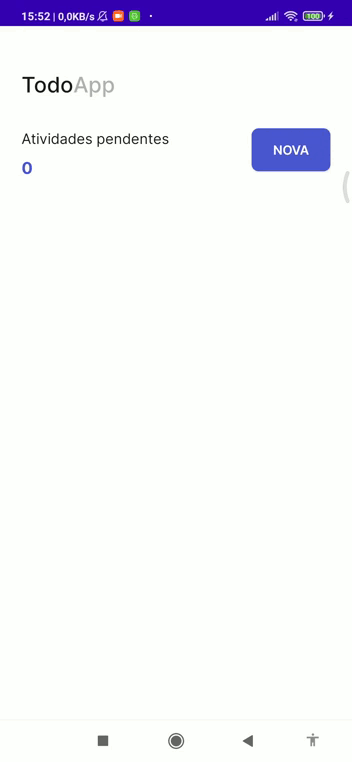

<h1 align="center">
  <strong>Todo App</strong>
</h1>
 

## Sobre o projeto 

Este é um aplicativo simples de to-do list desenvolvido em Kotlin com o intuito de por em pratica os conceitos de MVVM, LiveData, Room e Coroutines.   
 
 

<h1 align="center" display="flex">
   
</h1>

## Tecnologias - Technologies

Este projeto foi desenvolvido com as seguintes tecnologias:

- [Kotlin](https://kotlinlang.org/)
- [ViewBinding](https://developer.android.com/topic/libraries/view-binding?hl=pt-br)
- [LiveData](https://developer.android.com/topic/libraries/architecture/livedata?hl=pt-br)
- [Room](https://developer.android.com/training/data-storage/room?hl=pt-br)
- [Coroutines](https://developer.android.com/kotlin/coroutines?hl=pt-br#:~:text=Uma%20corrotina%20%C3%A9%20um%20padr%C3%A3o,linguagens%20(link%20em%20ingl%C3%AAs).)
- [Android Studio](https://developer.android.com/studio)
   
